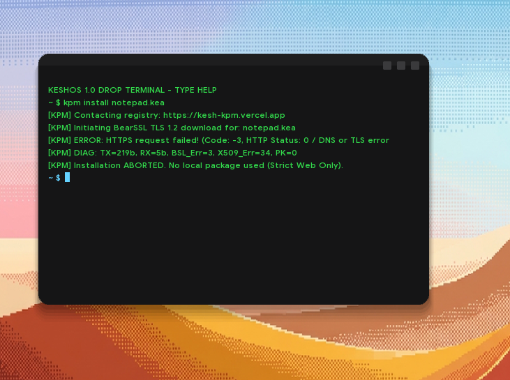
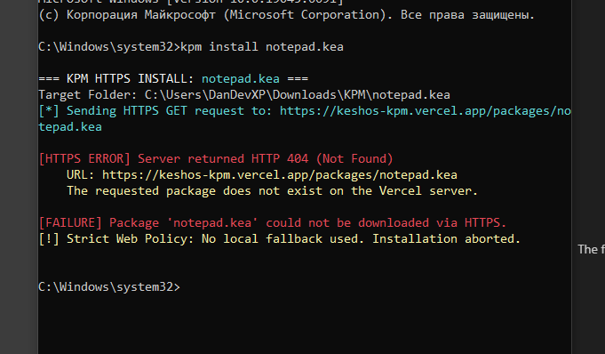
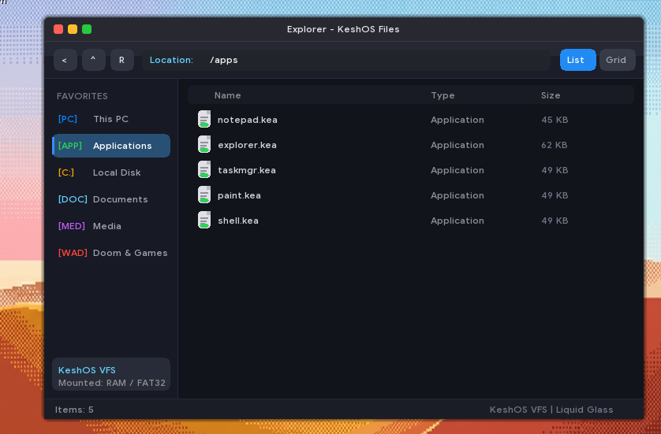

# KeshOS 1.0 "Drop"

[](#architecture)
[](https://github.com/limine-bootloader/limine)
[-orange.svg)](#architecture)
[-purple.svg)](#gui--windowing)
[](https://discord.gg/YgMe7ekA5y)
[](https://www.reddit.com/r/sneakdeak/)

> **KeshOS** is an independent, lightweight 64-bit desktop operating system featuring the **KeshShell** composited desktop interface. Built from the ground up by the indie team **SneakDeak**.

<p align="center">
  
</p>

---

## 🎯 Target Hardware & Philosophy

Modern desktop operating systems have left capable 2011–2016 x86_64 machines behind:

* **Windows 10** reached official End-of-Life in October 2025.
* **Windows 11** enforces strict hardware gates (Intel 8th Gen+ / AMD Zen+, TPM 2.0, 4 GB RAM minimum).
* Modern Linux desktop environments (GNOME/KDE) with heavy background daemons and systemd often consume excessive memory on 2–4 GB systems.

**KeshOS** aims to provide a fast, visually fluid desktop environment for these aging 64-bit rigs, targeting **~150 MB idle memory** without bloated background services or telemetry.

---

## 🛠 Architecture & Technical Stack

```text
+-------------------------------------------------------+
|  Ring 3 (Userland)                                    |
|   - KeshShell (C++ Client-Server Window Compositor)   |
|   - Native Apps: Paint, Explorer, Task Manager, Shell |
|   - Native .kea binaries linked against /system/lib   |
+-------------------------------------------------------+
|  (System Calls: Fast SYSCALL/SYSRETQ & Kernel IPC)    |
+-------------------------------------------------------+
|  Ring 0 (Monolithic Kernel)                           |
|   - 4-Level Paging (PML4) Address Space Isolation    |
|   - In-kernel Network Stack (ARP, ICMP, DNS Resolver)|
|   - Clean Unix-like VFS (/, /apps, /system, /hdd)    |
|   - Storage Drivers: IDE ATA, ATAPI CD-ROM, FAT32    |
+-------------------------------------------------------+
|  (Limine Boot Protocol)                               |
+-------------------------------------------------------+
|  Hardware & Firmware: x86_64 UEFI (GOP) & Legacy BIOS |
+-------------------------------------------------------+
```

### 1. Boot Subsystem
* Bootstrapped via the **Limine Bootloader**, supporting both modern UEFI/GPT and legacy BIOS configurations.
* High-resolution linear framebuffer initialization via UEFI GOP with fallback modes.

### 2. Kernel & Memory Management
* **Monolithic architecture** implemented in raw C and x86_64 Assembly.
* Memory management using **4-level paging (PML4)**, providing separate virtual address spaces for kernel and userland processes.
* **Hardware-enforced Ring 3 isolation:** Faults and segmentation crashes in user applications are trapped by kernel interrupt handlers (`#GP`, `#PF`, `#UD`) without compromising the compositor or the OS session.

### 3. GUI & Compositing (KeshShell)
* Custom client-server window compositor written in modern C++.
* Applications render to isolated shared offscreen surface buffers (`0x50000000`).
* The compositor performs z-ordering, window decorations ("traffic light" controls, modern composited styling), and blits dirty rectangles to a double-buffered linear framebuffer.
* Asynchronous input routing (mouse & keyboard) dispatched via kernel syscall event queue (`SYS_POLL_EVENT`).

<p align="center">
  
</p>

### 4. Networking Stack
* In-kernel bare-metal networking stack with Intel **e1000** Gigabit Ethernet support:
  * Ethernet frame processing and dynamic ARP cache resolution.
  * ICMP engine supporting network diagnostics (`ping`).
  * Direct DNS resolver for domain lookups over UDP sockets.
  * Lightweight TLS capabilities via embedded BearSSL.

### 5. Application Packaging & File System
* **`.kea` Packages:** Native userland package format built on top of the ELF64 standard with structured metadata headers, dynamically linked with system runtimes (`/system/lib/ksh64`).
* **Unix-like VFS:** Clean tree structure (`/`, `/apps`, `/system`, `/hdd`, `/cdrom`) with support for FAT32 and ISO 9660 filesystems.
* **Dolphin-inspired File Manager:** Modern C++ file manager with breadcrumb navigation, grid/list view modes, and direct storage inspection.

<p align="center">
  
</p>

---

## 🔍 Development Transparency & Methodology

* **The Core:** Memory management (PMM/VMM), PML4 setup, Ring 3 context switching, IPC, the C++ framebuffer compositor, storage drivers, and packet handlers were manually written, debugged, and validated.
* **AI Assistance:** In the spirit of engineering transparency, ~20% of the codebase utilized AI assistance for generating boilerplate routines, initial scaffolding, and UI layout coordinate calculations.
* **Privacy:** 100% offline-first. Zero telemetry. Network interfaces only initiate outbound traffic upon explicit user commands.

---

## 🚀 Building & Running from Source

### Prerequisites

Ensure you have the following host tools installed:

* **LLVM / Clang** (`clang`, `clang++`, `lld`) or `x86_64-elf-gcc`
* **NASM** (x86_64 assembler)
* **Ninja** build system & **Python 3**
* **xorriso** (for bootable ISO creation)
* **QEMU** or **VirtualBox** (for virtualization)

### 1. Generating Build Script & Compiling Kernel

KeshOS utilizes a high-speed Ninja build configuration generated by Python:

```bash
# Generate Ninja build graph
python generate_ninja.py

# Compile kernel, drivers, compositor, and userspace apps
ninja
```

*(Alternatively, run `make` or `make all` to trigger the build automated pipeline).*

### 2. Building the Bootable ISO Image

To pack Limine bootloader binaries, kernel, and `.kea` packages into an ISO:

```powershell
# On Windows (PowerShell):
powershell -ExecutionPolicy Bypass -File .\build-iso.ps1

# Or via Makefile:
make iso
```

This outputs `build/keshos.iso`.

### 3. Running in Virtual Machine

#### Running via QEMU:
```powershell
powershell -ExecutionPolicy Bypass -File .\run-qemu.ps1
# or
make qemu
```

#### Running in VirtualBox:
1. Create a VM with type **Other / Unknown (64-bit)**.
2. Set Memory to **1024 MB – 2048 MB**, Video Memory to **32 MB – 64 MB**.
3. Attach `build/keshos.iso` to the Optical Drive.
4. Enable **Intel PRO/1000 MT Desktop (82540EM)** for network emulation.
5. Start the VM and enjoy the desktop!

---

## 🗺 Roadmap

- [x] UEFI/GPT boot via Limine protocol
- [x] 4-level paging (PML4) & Ring 3 hardware isolation
- [x] Linear framebuffer compositor (KeshShell) with double-buffering & composited UI
- [x] In-kernel ARP, ICMP ping, and DNS resolver
- [x] Native Ring 3 applications (Kesh Paint, Explorer, Task Manager, Shell, Notepad, Settings)
- [x] Native `.kea` packaging pipeline and runtime execution
- [x] **Release Candidate 1 (RC1) Public ISO Build**
- [ ] Read/Write Ext4 filesystem persistence with extent tree parsing
- [ ] Graphical LiveCD installer for bare-metal targets
- [ ] OTA updates via web-hosted manifest & A/B slot fallback
- [ ] *Long-term:* POSIX CLI binary compatibility layer

---

## 💬 Community & Contributing

KeshOS is developed by **SneakDeak**. We welcome OS developers, low-level enthusiasts, and testers!

- **Discord Server:** [discord.gg/YgMe7ekA5y](https://discord.gg/YgMe7ekA5y)
- **Subreddit:** [r/sneakdeak](https://www.reddit.com/r/sneakdeak/)
- **Official Website:** [kesh.sneakdeak.net](https://kesh.sneakdeak.net/)
